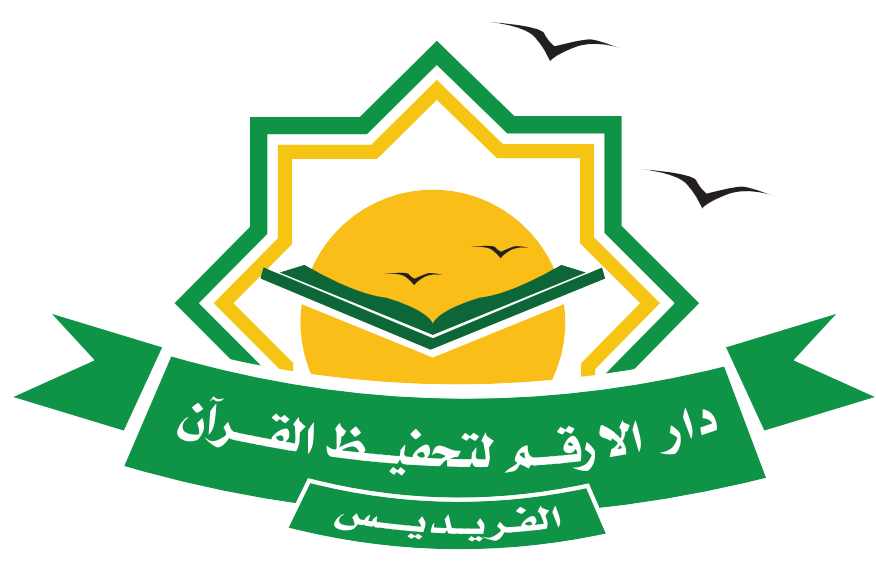

بسم الله الرحمن الرحيم

## DarAlarkam Main App

The DarAlarkam Main App is a Flutter-based mobile application designed for educational institutions. It offers a user-friendly interface to manage classrooms, users, and class reports.

## Overview

The DarAlarkam Main App simplifies administrative tasks for educational institutions. It allows you to create and manage classrooms, track student records, and generate class reports. With user-friendly features and cloud-based storage, it's an essential tool for educators.

## Table of Contents

- [Getting Started](#getting-started)
- [Installation](#installation)
- [Usage](#usage)
- [Features](#features)
- [Contributing](#contributing)
- [License](#license)

## Getting Started

To get started with the Daralarkam Main App, follow the steps below:

1. Clone the repository.
2. Install the required dependencies using Flutter.
3. Configure the Firebase project with your credentials.
4. Run the app on your local machine or a physical device.

## Installation

1. Clone the repository:
   git clone https://github.com/your-username/daralarkam-main-app.git
2. Install the project dependencies:
   flutter pub get
   - Android Installation:
   1. run this code:
      flutter build apk --release
   2. Install the apk file which located in:
      DarAlArkam-MainApp\build\app\outputs\apk\release
   
   - IOS installation:
   to be continued...

## Usage

The DarAlarkam Main App offers the following features:
- Create and manage classrooms with ease.
- Add, edit, or delete students and teachers.
- Generate class reports for tracking student progress.
- User-friendly UI with a rich set of features.

## Features

- Classroom Management
- User Management
- Class Reporting
- Firebase Integration
- Responsive UI Design

## Team Collaboration

This project is developed and maintained by our internal team. If you're a team member or collaborator, here are the guidelines for working on this project:
- Collaborators can create feature branches and merge their changes through our internal workflow.
- All changes should be reviewed by a team lead or project manager before merging.
- You can contact me at Yossef.sgl@gmail.com for further information.

## License

This project is proprietary software, and all rights are reserved by DarAlarkam. You may not redistribute or modify the code or assets without explicit permission from DarAlarkam.

## Contact
For questions, feedback, or support, please reach out to our team:

- Email: dev.daralrkam@gmail.com
